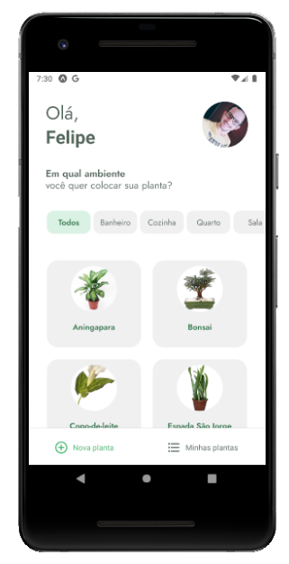
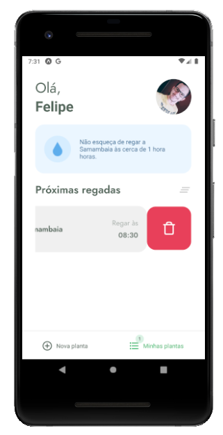
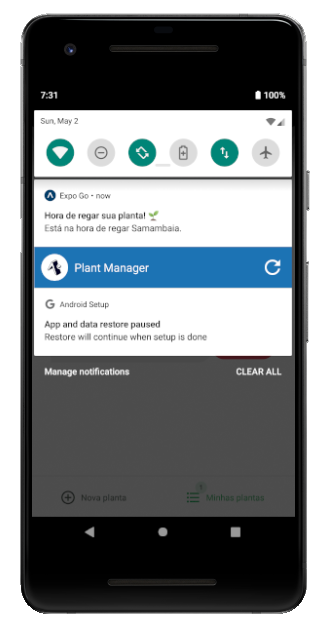

# Plant Manager

	

Este projeto implementa um aplicativo para orientação aos cuidadores de plantas. Aqui foram inseridos diversos conceitos de usabilidade e uso de alguns recursos do smartphone, como notificações, vibração e armazenamento offline.

## 🚀 Começando

### 📋 Pré-requisitos

- [NodeJS](https://nodejs.org)
- [NPM](https://www.npmjs.com) (ou [Yarn](https://yarnpkg.com))
- Instalar o [Expo](https://expo.io/) no dispositivo que será usado para o teste ([Android](https://play.google.com/store/apps/details?id=host.exp.exponent) ou [IOS](https://apps.apple.com/br/app/expo-go/id982107779))

### 🔧 Instalação

- Clonar o projeto: `git clone https://github.com/felipeleite11/plant-manager.git`
- Executar a instalação das dependências: `npm install` ou `yarn`
- Instalação do Expo no dispositivo onde a aplicação será executada
- Executar a fake API integrada no projeto com `npm run api` ou `yarn api`
- Executar a aplicação com `expo start`
- Caso esteja usando um dispositivo real, ao visualizar o QRCode em seu terminal, o escaneie
- Caso esteja usando um emulador, acesse `http://localhost:19002` em seu navegador e clique em `Run on Android` ou `Run on IOS`
- O aplicativo Expo será automaticamente aberto e o aplicativo poderá ser carregado para teste

## 📦 Desenvolvimento

Alguns dos recursos que foram aplicados:
- Armazenamento local de dados
- Notificações agendadas (cadastro e cancelamento)
- Efeito swipe em listas
- Vibração do dispositivo
- Acesso a API externa
- Lista com carregamento sob demanda
- Uso da Context API do React
- Uso de fontes externas

Os conceitos aplicados neste projeto podem ser totalmente reaproveitados em outros projetos. Cabe também explorar diversos outros recursos do smartphone suportados pelo Expo.

## 🛠️ Construído com

* [React Native](https://reactnative.dev/) - Usado para geração de código nativo para as plataformas mobile
* [Expo](https://expo.io/) - Usado para dar agilidade ao processo de desenvolvimento e depuração
* [NodeJS](https://nodejs.org) - Usado para processsar o código React que gerou as telas do app

## 📲 Demonstração

	
	
	
	
	

